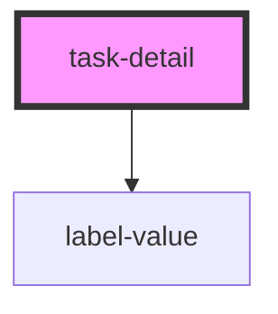

# task-detail

<!-- Auto Generated Below -->

## Properties

| Property      | Attribute     | Description | Type     | Default     |
| ------------- | ------------- | ----------- | -------- | ----------- |
| `date`        | `date`        |             | `string` | `undefined` |
| `description` | `description` |             | `string` | `undefined` |
| `img`         | `img`         |             | `string` | `undefined` |
| `labels`      | `labels`      |             | `string` | `undefined` |
| `notes`       | `notes`       |             | `string` | `undefined` |

## Dependencies

### Depends on

- [label-value](../detail-components)

### Graph

----------------------------------------------

*Built with [StencilJS](https://stenciljs.com/)*
